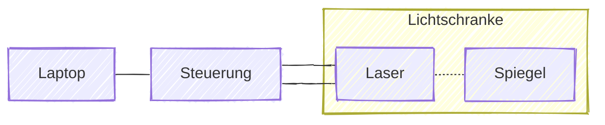

# MSC-Backnang-Zeitnahme

## Inhalt Koffer

Koffer "Zeitnahme" beinhaltet:

-   Laptop
-   Netzteil Laptop
-   RJ11-USB-Kabel
-   Spiegel (mit Stativ)
-   Laser (mit Stativ)
-   Steuerung
-   Verbindungskabel Steuerung-Laser

> [!TIP]
> Stelle sicher, dass der Laptop vollständig aufgeladen ist, bevor du ihn benutzt oder schließe ihn an das Stromnetz an.

## Diagramm der Verkabelung

## Aufbau

1. Steuerung mit Laptop verbinden
2. Laptop einschalten
3. Steuerung einschalten
    1. `ON` 2 Sekunden gedrückt halten
    2. `#` drücken
    3. `#` drücken
    4. `1🟢` drücken
    5. `🔴 (L)` drücken
4. Laser und Spiegel aufbauen
    1. Stative anschrauben
    2. Laser mit Steuerung verbinden
        - Grün an grün
        - Schwarz an schwarz
    3. Laser einschalten (Schalter auf `ON`)
    4. Laser und Lichtschranke ausrichten (Lampe `Signal` muss erlöschen)

## Abbau

1. Laptop herunterfahren
2. Steuerung ausschalten
    1. `F` drücken
    2. `▲` drücken
    3. `#` drücken
    4. `*` drücken
3. Steuerung von Laptop trennen
4. Laser und Spiegel abbauen
    1. Laser ausschalten (Schalter auf `OFF`)
    2. Laser von Steuerung trennen
    3. Stative abschrauben

> [!IMPORTANT]
> Der Laptop sollte nach dem Gebrauch aufgeladen werden, um ihn für den nächsten Einsatz bereit zu halten.

---

---

---

> [!CAUTION]
> Die folgenden Teile der Anleitung sind nicht fertig gestellt!
> Sie dienen als Platzhalter für zukünftige Erweiterungen.

---

---

---

## Manueller Modus

> [!NOTE]
> Im manuellen Modus sind mehr Funktionen verfügbar, das System muss allerdings von einer Person bedient werden. Ohne die Bedienungsperson kann das System nicht betrieben werden.

### Aktivieren

1. Einstellungsseite öffnen
2. Modus auf `Manuell` setzen

### Deaktivieren

1. Rechner neustarten

oder

1. Einstellungsseite öffnen
2. Modus auf `Standalone` setzen

### Betrieb

#### Fahrer aktivieren

#### Zeiten-Reset

#### Fahrer auswählen

#### Fahrer erstellen

#### Betrieb

#### Multi-Window

## Probleme (und deren Lösungen)

-   Am Laser leuchtet `Batt`
-   Steuerung geht nicht an
    -   Batterie leer
-   Steuerung sendet zwar Signal via `1`, aber nicht durch Laser
    -   Laser verbunden
    -   Sperre `🔴(L)` deaktivieren
-   Steuerung piept aber keine Aktion am Laptop
    -   Steuerung verbunden?
    -   Steuerung neustarten
-   Steuerung druckt alles aus
    -   Drucker deaktivieren

---

[Installationguide (english)](/docs/installEN.md)
